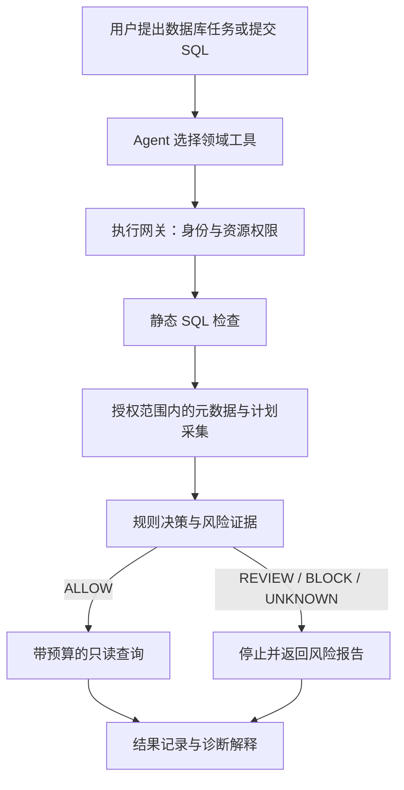

# db-agent

面向研发人员实际数据库工作流程的 Agent。从 **MySQL SQL 风险预检与诊断** 开始，逐步扩展查询分析、业务记忆和受控数据库变更，以明确授权、受控执行和可核对的结果作为使用要求。

首版采用 **Python + LangChain + OpenAI 兼容模型接口**。使用 LangChain 的 `create_agent` 管理模型和工具协议，减少基础运行时开发，把精力放在数据库业务、执行边界和验证上。

> **当前状态：已提供 SQL 预检、普通 EXPLAIN 诊断、受控 SELECT、会话内多轮查询、经确认的跨会话业务知识、需登录的本机多身份 Web 页面和固定电商业务评测。** CLI 和 Agent 可以读取授权表结构、获取 MySQL 8.4 或 PostgreSQL 18.6 的真实计划，并在执行入口重新检查后查询业务数据。查询回答根据工具实际报告生成；支持百万订单合成数据的分批导入与独立口径验收。业务知识通过本机 CLI 或登录后的 Web 面板分别管理、持久化和显式引用，详见[业务知识说明](docs/knowledge.md)。已提供原/候选 SQL 的同快照结果核对和优化观测，详见[SQL 优化验证](docs/optimization.md)。已提供[限定单行库存变更](docs/changes.md)的 Web 预览、人工审批、事务执行、回执核对与反向恢复；通用 SQL 等价证明、任意 DDL/DELETE 和生产变更尚未实现。

项目大步骤、完成状态和下一步优先级统一维护在 [TODO 清单](TODO.md)。开始新任务前先核对清单，再按本文查找运行方式与能力限制。

已加入独立需求合同、完整 SQL 编译与最终复核，修复已知漏筛选与退款关联缺失问题。初始模型可从授权候选表名选择相关表，仍须读取实际结构；生成查询遵循现有 SQL 子集。第11步的真实 Agent 新题16/16、旧题61/64，超时或复核协议失败如实保留，详见[电商验收记录](docs/ecommerce.md#2026-09-11-v8-最终业务验收)。第12步已完成[会话内多轮查询](docs/conversations.md)的约定场景验收：固定验收集两次合计18/18轮（每次9/9）通过，开发集首次8/9、追加回归9/9；首次模型超时未计为成功。第13步[持续集成与可复现交付](docs/delivery.md)已通过真实 GitHub CI；提供方返回计数超请求的异常和硬上限限制继续保留。

## 快速开始

使用 [uv](https://docs.astral.sh/uv/getting-started/installation/) 管理依赖；项目固定开发 Python 版本为 3.13，具体依赖版本记录在 `uv.lock`。

```bash
git clone https://github.com/erha1499/db-agent.git
cd db-agent
uv sync --locked

cp .env.example .env
# 编辑本地 .env，填写三个模型必填配置后运行
uv run db-agent config
uv run db-agent check
```

`config` 校验模型配置，仅显示三个必填项的状态，不显示值，也不请求模型；`check` 仅发起一次真实模型请求，不连接数据库。完成下方数据库配置后，可以使用 `db` 子命令或带领域工具的 `chat`；每次 `chat` 是独立问答，非流式返回回复。`uv run db-agent session` 提供[会话内多轮查询](docs/conversations.md)，仅在内存保留完整成功查询的用户请求，失败后要求 `/reset`，退出即清空。也可以使用 `uv run python -m db_agent` 调用相同命令。

| 配置项 | 用途 | 默认值 |
| --- | --- | --- |
| `DB_AGENT_OPENAI_BASE_URL` | OpenAI 兼容接口的基础 URL | 必填 |
| `DB_AGENT_API_KEY` | 模型接口凭据 | 必填 |
| `DB_AGENT_MODEL` | 模型名称 | 必填 |
| `DB_AGENT_REQUEST_TIMEOUT_SECONDS` | 单次模型请求超时（秒） | `30` |
| `DB_AGENT_RUN_TIMEOUT_SECONDS` | 一次 Agent 运行的模型与工具总时限（秒） | `60` |
| `DB_AGENT_MAX_OUTPUT_TOKENS` | 向模型请求的每次输出 token 上限 | `1024` |
| `DB_AGENT_MAX_MODEL_CALLS` | 一次 Agent 运行的模型调用上限 | `4` |
| `DB_AGENT_MAX_TOOL_CALLS` | 一次 Agent 运行的工具调用上限 | `6` |

应用的模型与数据库配置优先读取当前工作目录的 `.env`，未定义的配置项才回退到同名 `DB_AGENT_*` 环境变量，避免旧 shell 配置覆盖本地修改。复制 [.env.example](.env.example) 后，在本地 `.env` 填写真实配置；应用不会执行 shell 配置文件。`.env` 和 `.env.*` 由 Git 忽略，只有占位模板 `.env.example` 纳入版本控制，真实配置不得提交或推送。运行时禁用 LangSmith tracing，避免继承本机 tracing 配置后上传对话。

本地验证入口：

```bash
uv run pytest
uv run ruff check .
git diff --check
```

离线测试验证配置、静态规则、构造计划、连接器边界、结果处理与 Agent 协议；真实模型连通性单独通过 `check` 验证，数据库连接使用 `db check` 验证。实际诊断与查询链路使用下方 `db analyze` / `db query` / `chat`，不同层次的验证不能互相替代。

GitHub Actions 的覆盖范围、锁定依赖的构建安装、目标环境验收和显式提供方核验见[持续集成与可复现交付](docs/delivery.md)。CI 状态以当前 PR HEAD 对应的远端运行结果为准；默认不运行真实模型评测。

## 本地 Web 页面

[Web 使用说明](docs/web.md)提供常见 AI 对话界面，包括会话历史、智能查询、SQL 诊断、结果表格、表结构、运行进度和停止。查询完成后可在[分析与交付](docs/result-delivery.md)中选择维度和数值列，生成分组对比、时间趋势，下载带原始 SQL 与范围说明的 HTML 报告或 JSON 快照；分析只处理已保存结果，不再调用模型或数据库。保留 CLI `session` 的完整请求包与严格查询结果校验；Web 历史持久化到本机，仅成功查询的用户原始请求用于后续口径。

```bash
uv run python scripts/manage_web_users.py set alice --tables orders --allow-model --model-tables orders
npm --prefix frontend ci --registry=https://registry.npmjs.org
npm --prefix frontend run build
uv run db-agent web
```

浏览器打开 <http://127.0.0.1:8000>。先按[本机多身份接入](docs/web-access.md)创建私有身份配置并登录。这是本机多身份、单进程入口，表权限和模型表范围由服务端配置，历史、结果、运行与知识按用户和授权代际隔离；源码安装需要 Node.js，前端产物不包含在 Python wheel。历史包含问题、SQL 和有限查询结果，保存在忽略的 `outputs/web`，区别于脱敏运行日志；失败或不完整查询后需新建对话并完整重述。

## 受控数据库变更

登录后通过“受控变更”完成独立合成 MySQL 单行库存调整。默认关闭，需要另建固定本机目标和服务端变更授权；原查询路径仍只读，不提供模型写入工具。完整准备、审批、未知结果核对、恢复、真实验收和资源清理见[受控变更说明](docs/changes.md)。

## 业务知识与新会话复用

[业务知识说明](docs/knowledge.md)提供指标口径、声明表关系与 SQL 模板的本机持久化。使用 `db-agent knowledge create --stdin` 保存草稿，`show` 审阅来源和完整摘要，`confirm <id> --digest <digest>` 确认，`revoke` 处理失效。新进程的 `chat`、`session` 或新建 Web 对话可输入 `[[knowledge:<id>]]` 显式取用。

知识按项目、数据源、账号和白名单隔离，记录来源/版本、有效期和人工失效条件；实际结构变化、撤销、过期和存储失败均停止。当前明确请求优先；知识不提供执行授权，查询仍走原 SQL、计划、只读事务和预算检查。它不恢复旧聊天或业务结果，没有隐式保存模型输出或自动注入。

## PostgreSQL 数据源与条件聚合

已增加独立 PostgreSQL 18.6 reader 和 searched `CASE WHEN` 条件聚合，覆盖授权元数据、
方言预检、普通 EXPLAIN、受控查询、真实自然语言查询，以及知识/历史/结果与身份隔离。
数据源由 `.env` 的 `DB_AGENT_DATABASE_KIND=mysql|postgresql` 选择，默认仍为MySQL；
PostgreSQL使用独立 `DB_AGENT_POSTGRES_*` 凭据，不能从MySQL配置或模型输入获得授权。
独立环境位于 `127.0.0.1:15432/db_agent_pg.business`，不修改现有MySQL。

```bash
uv run python scripts/setup_postgres.py --apply
uv run python scripts/setup_postgres.py --verify-only
# 按说明将reader配置填入当前.env后，可使用原db/chat/session/web入口
```

配置、SQL边界、事务与类型差异、验收和清理见[PostgreSQL使用说明](docs/postgresql.md)。

## 本地 MySQL

[compose.yaml](compose.yaml) 提供 MySQL 8.4.11 本地实例，使用 Docker Compose 项目 `db-agent` 和服务 `mysql`。先启动 OrbStack 或其他 Docker 运行环境，在现有 `.env` 中填写两个独立的数据库密码，再从仓库根目录运行：

```bash
docker compose up -d --wait
docker compose ps
```

| 配置项 | 本地值或要求 |
| --- | --- |
| `DB_AGENT_MYSQL_HOST` | `127.0.0.1` |
| `DB_AGENT_MYSQL_PORT` | `13306`；映射到容器 `3306` |
| `DB_AGENT_MYSQL_DATABASE` | `db_agent` |
| `DB_AGENT_MYSQL_USER` | `db_agent_reader` |
| `DB_AGENT_MYSQL_PASSWORD` | 在 `.env` 设置；24–128 位字母、数字、`_` 或 `-` |
| `DB_AGENT_MYSQL_ROOT_PASSWORD` | 在 `.env` 单独设置，仅用于本地管理 |
| `DB_AGENT_MYSQL_ALLOWED_TABLES` | 元数据、SQL 分析与业务数据读取允许访问的表名 JSON 数组，默认 `[]` |
| `DB_AGENT_MYSQL_CONNECT_TIMEOUT_SECONDS` | 连接超时，默认 `3` 秒 |
| `DB_AGENT_MYSQL_METADATA_TIMEOUT_SECONDS` | 单次元数据请求时限，默认 `5` 秒，包含连接器内排队、连接和读取 |
| `DB_AGENT_MYSQL_MAX_METADATA_ROWS` | 单次元数据结果行数上限，默认 `200` |
| `DB_AGENT_MYSQL_MAX_METADATA_BYTES` | 单次元数据结果 JSON 字节上限，默认 `32768` |

服务只绑定本机 `127.0.0.1`，默认容器名为 `db-agent-mysql-1`，数据保存在命名卷 `db-agent_mysql_data`。首次初始化创建 `db_agent` 数据库，并仅为 `db_agent_reader` 授予该数据库的 `SELECT` 和 `SHOW VIEW` 权限。应用按上表连接配置访问数据源；修改主机、数据库名或用户名不会改变 Compose 的固定绑定或初始化对象。Agent 拒绝使用 root，表名白名单独立限制元数据和业务数据读取。当前没有列级或行级权限；将表加入白名单意味着允许读取其中支持的列与行。

宿主机的数据库客户端使用上表连接信息，密码取自本地 `.env`。已安装 MySQL CLI 时可交互输入密码连接：

```bash
mysql --protocol=TCP --host=127.0.0.1 --port=13306 --user=db_agent_reader --password db_agent
```

root 仅用于容器内本地 socket 管理，执行以下命令后交互输入 root 密码：

```bash
docker compose exec mysql mysql -uroot -p
```

停止服务并保留数据：

```bash
docker compose stop mysql
```

账号与密码只在空数据卷首次启动时初始化。已有数据卷后修改 `.env` 不会自动修改数据库密码；需要通过 SQL 修改对应账号密码，再同步本地配置。本地实例配置不代表生产部署或数据库业务验收完成。

### 创建合成业务数据与读取结构

数据库启动不会自动创建业务表。管理员可以执行固定的本地初始化脚本：

```bash
uv run python scripts/seed_local_mysql.py
```

[脚本](scripts/seed_local_mysql.py) 先核对 `db-agent/mysql` 容器及 `db_agent` 数据库，再执行固定的[合成业务数据](tests/fixtures/mysql_business.sql)：`customers`、`orders`、`order_items`，包含主键、外键、复合索引，以及取消、退款、零金额、无订单客户等边界数据。任一点名表已存在时，整个初始化停止，不写入或覆盖；重复运行只报告已有表。DDL 中途失败可能保留已建表，脚本不会自动重试或删除。

这是管理员开发脚本，不是 Agent 工具，不接受自定义 SQL 或目标参数。root 凭据只在容器内用于初始化，业务连接使用 reader。接着在本地 `.env` 中明确授权表名：

```dotenv
DB_AGENT_MYSQL_ALLOWED_TABLES='["customers","orders","order_items"]'
```

```bash
uv run db-agent db check
uv run db-agent db tables
uv run db-agent db describe orders
uv run db-agent chat "查看 orders 的字段和索引，说明按 customer_id 和 created_at 查询时可考虑哪些索引。"
```

`db` 子命令不需要模型凭据；`chat` 需要模型与数据库配置，接入 `list_tables`、`describe_table`、`analyze_sql`、`execute_query`。白名单为空时不列出任何表，引用未授权表会被拒绝。元数据工具返回基础表的表名、字段、索引，以及同库授权基础表之间声明的外键列对；不返回注释、默认值或业务行。复合外键保持完整列顺序，组件共享原有元数据行数与字节预算，超限时不返回半条关系。`foreign_keys_scope` 明确目标范围；空列表不表示数据库没有其他关系，外键声明也不证明历史数据均符合约束。模型不能根据字段名或索引补造关系事实。

### SQL 预检与诊断

```bash
uv run db-agent db analyze 'SELECT id, customer_id FROM orders ORDER BY created_at LIMIT 10'
uv run db-agent chat '分析 SELECT id, customer_id FROM orders ORDER BY created_at LIMIT 10；引用真实结构和计划，区分估算与建议，不做变更。'
```

直接 CLI 由业务代码完成检查与计划取证，返回 JSON；`chat` 由主模型选择工具，读取相同报告后解释问题与建议。`analyze_sql` 内部不调用 LLM；框架层只负责协议、工具白名单、顺序执行和预算，放行规则在领域代码和连接器中。

含敏感字面值的 SQL 可以通过 `db analyze --stdin` 或 `db query --stdin` 输入，避免写入命令参数或 shell 历史；输入为受长度限制的 UTF-8。直接 `db` CLI 不调用模型。`chat` 会把问题、SQL、元数据及脱敏计划摘要发送给配置模型，这些输入应适合该模型的使用范围；查询返回行由程序直接展示，查询工具轮后不再请求模型。

当前支持单条完整 `SELECT`、单表和带 `ON` 的显式 `INNER` / `LEFT JOIN`、基础比较与算术、分组、排序、`LIMIT`，以及 `COUNT` / `SUM` / `AVG` / `MIN` / `MAX`，以及 searched `CASE WHEN` 条件表达式。函数名必须紧接左括号，不能加反引号或数据库限定。CTE、子查询、UNION、窗口函数、DISTINCT、无表来源、未绑定占位符等返回 `UNKNOWN`；写操作、越界表、文件操作、锁定读取和非批准函数返回 `BLOCK`。实际注释与提示、未支持的标识符及语法明确拒绝；字符串中的标记按词法区分。使用 MySQL 方言 AST 和节点/参数白名单，不以解析成功当作安全证明，也不改写原 SQL 后冒充原计划。

`explain_checked` 自身每次重新预检，通过后验证当前库、SQL 模式、基础表类型和 MySQL 8.4，固定 JSON 计划版本 1，仅读取 `EXPLAIN FORMAT=JSON`。新版本、其他 SQL 模式或无法识别的计划进入 `UNKNOWN`。计划保留访问路径、索引、估算扫描/产出行数和排序证据；不回传原始条件、字面值或完整计划。单次扫描估算超阈值、连接阶段产出过大、规模较大的排序/临时表返回 `REVIEW`；缺少关键证据不按零处理，小表全扫不机械阻断，`LIMIT` 不豁免大扫描。

| `DB_AGENT_ANALYSIS_` 后缀 | 默认值 | 用途 |
| --- | --- | --- |
| `MAX_SQL_BYTES` / `MAX_AST_NODES` / `MAX_AST_DEPTH` | `16384` / `512` / `32` | SQL 输入与解析复杂度预算 |
| `MAX_TABLES` | `8` | 单条 SQL 的表引用上限 |
| `MAX_PLAN_BYTES` / `MAX_PLAN_NODES` | `65536` / `256` | 计划字节与 JSON 值节点预算 |
| `TIMEOUT_SECONDS` | `10` | 单次诊断预算，包含连接器排队、连接与读取 |
| `REVIEW_SCAN_ROWS` / `REVIEW_JOIN_ROWS` / `REVIEW_SORT_ROWS` | `100000` / `1000000` / `100000` | 估算行数审核阈值，严格超过时命中 |

阈值是初始策略，需结合目标环境校准；不是实测耗时或生产安全保证。报告额外有固定 8 KiB 元数据预算。每个报告包含 `report_id`、策略版本、时间、数据库、结构指纹、规则与证据；结构指纹去掉字面值，仅用于关联同形 SQL，不是参数绑定凭证或执行授权。基础表校验与计划采集不是整个数据库的原子快照。超时关闭连接并停止等待，不能据此声称服务器已取消查询。

`db analyze` 的四种 `decision` 都只返回报告，不执行业务 SQL。该命令成功生成报告时退出码为 `0`，包括 `BLOCK` / `REVIEW` / `UNKNOWN`；配置错误为 `2`、报告外运行失败为 `1`，脚本必须读取 `decision`。业务拒绝也会正常回填给主模型解释。

### SQL 优化验证

`db compare` 实际执行原 SQL 与候选 SQL，使用同一受控执行内核与只读一致性快照，按列位置、完整行、多重集或排序核对结果；任一拒绝、截断、错误或缺证据均不能确认相等。直接入口不调用模型，双方仍分别完成全部原预检。

```bash
uv run db-agent db compare \
  --original 'SELECT id FROM orders WHERE id + 0 = 1002' \
  --candidate 'SELECT id FROM orders WHERE id = 1002' --repeat 3
```

敏感输入使用 `db compare --stdin` 的有界 `original` / `candidate` JSON。报告给出实际计划估算与客户端派发/读取耗时，区分本次完整结果一致、独立业务 oracle 和通用等价证明。`observed_equal` / `different` / `inconclusive` 分别退出 0 / 4 / 1，输入配置错误退出 2。重复 1–3 对，每对共用原 15 秒总预算；不放宽扫描阈值。独立边界案例、真实百万订单范围观测和完整限制见[优化验证说明](docs/optimization.md)。

### 受控业务查询

`db query` 与 Agent 的 `execute_query` 使用同一执行入口。准备好上述固定合成数据后，可以比较两种时间口径：

```bash
uv run db-agent db query "SELECT COUNT(*) AS order_count, SUM(total_amount) AS total FROM orders WHERE status = 'paid' AND created_at >= '2026-02-01' AND created_at < '2026-03-01'"
uv run db-agent db query "SELECT COUNT(*) AS order_count, SUM(total_amount) AS total FROM orders WHERE status = 'paid' AND paid_at >= '2026-02-01' AND paid_at < '2026-03-01'"
uv run db-agent chat '分别按 created_at 和 paid_at 查询 2026 年 2 月 paid 订单的笔数和金额，解释两种口径的差异。'
```

固定 fixture 中，按创建时间统计返回 `[[2, "30.00"]]`，按支付时间统计返回 `[[3, "130.00"]]`。这说明时间口径会改变业务结果；这些预期值由合成数据独立推导，不代表任意候选 SQL 已完成结果等价证明。

`MetadataConnector.execute_checked` 每次重新做静态检查，不接收旧报告或批准参数。它在同一连接的 `READ COMMITTED`、显式 `START TRANSACTION READ ONLY` 事务中取普通 EXPLAIN，核对目标库、版本、SQL 模式与 JSON v1；在 EXPLAIN 前后分别检查所有引用对象为 `BASE TABLE` / `InnoDB`。开始事务后、派发业务 SQL 前分别确认协议中的只读事务状态，只有全部证据为 `ALLOW` 才发送原始 SQL。事务随连接关闭结束；独立分析报告不会成为可复用授权。

| `DB_AGENT_QUERY_` 后缀 | 默认值 | 用途 |
| --- | --- | --- |
| `MAX_ROWS` | `100` | 返回行数上限，最多多读一行判断截断 |
| `MAX_RESULT_BYTES` | `32768` | 返回结果对象的 JSON 字节预算 |
| `MAX_COLUMNS` | `64` | 结果列数上限 |
| `EXECUTION_TIMEOUT_SECONDS` | `5` | 从派发 SELECT 起计时，包含结果读取；同时设置 MySQL `max_execution_time` |
| `OPERATION_TIMEOUT_SECONDS` | `15` | 一次查询总预算，包含连接器排队、连接、分析和读取 |

查询分析阶段另受 `DB_AGENT_ANALYSIS_TIMEOUT_SECONDS` 限制；每个连接器仍顺序处理请求。查询会话时区固定为 `+00:00`。`columns` 按位置描述列，`rows` 是同位置的数组，重名列不会互相覆盖；`Decimal` 金额及超过 JavaScript 安全整数范围（±(2^53−1)）的大整数返回字符串，`NULL` 返回 `null`，日期时间使用 ISO 格式。`DATETIME` 本身没有时区，`TIMESTAMP` 按会话 UTC 返回；当前拒绝 TEXT/BLOB、JSON、BIT、SET 和空间等结果类型。响应尚未携带 MySQL 服务器 warning，不能据此判断查询没有警告。

响应分别报告业务 `status`、预检 `decision` 和 `execution_status`，不能只读其中一个字段：

| `status` | 含义 | `db query` 退出码 |
| --- | --- | --- |
| `ok` | 已取得结果，执行状态为 `completed` 或 `truncated` | `0`，包括截断 |
| `rejected` | 静态或计划规则拒绝，业务 SQL 未派发 | `3` |
| `error` | 取证或执行发生错误；派发后失败的执行状态为 `unknown` | `1` |

配置或 CLI 输入错误退出码为 `2`。`ALLOW` 不代表执行成功，`result` 才包含实际返回数据。CLI 的 `result_id` 仅关联本次结果；Web 提供绑定当前会话与数据源的已保存结果取回和下载，不能取回任意 CLI 结果；工具协议正常结束也不等于业务成功。

行数或字节超限会返回截断结果，`row_count` 仅为返回行数，不能当作原查询总行数。`truncated=false` 的完整性仅针对当前 SQL 的结果，仍受其 `WHERE` / `LIMIT` 限制。`result_bytes` 统计完整结果对象的 JSON 大小，不是扫描量、网络流量或单字段内存上限；查询响应的 `duration_ms` 包含预检、计划采集和读取，不是纯 SQL 执行耗时。业务查询用 `SSCursor` 逐行读取，截断时直接关闭连接，不调用会排空剩余结果的游标关闭；超时和取消也清理连接，但不能据此宣称服务器已确认取消 SQL。截断时 `server_statement_status` 保持 `unknown`。

### 数据库验证与运行记录

电商场景提供独立的六张 `ec_*` 表、百万订单生成与导入脚本，以及固定开发集和冻结验收集。完整步骤、表关系、金额口径和验收命令见 [电商数据与业务验收](docs/ecommerce.md)。原有三张小表用于快速回归，两个数据集可以共存。

合成数据与白名单准备好后，显式运行真实 MySQL 集成测试：

```bash
DB_AGENT_MYSQL_INTEGRATION=1 uv run pytest tests/test_mysql_integration.py tests/test_mysql_query.py -q
```

普通 `uv run pytest` 会跳过这些集成测试，避免隐式依赖数据库。上述集成测试不创建数据，验证真实元数据、账号权限、普通 EXPLAIN、业务查询结果和截断后的连接清理；固定 INSERT 权限探针使用零行条件，并在事务结束时回滚。驱动采用 `aiomysql[rsa]`，包含本地 MySQL 密码认证所需的 RSA 支持。

事务与元数据锁验证需要独立显式开启：

```bash
DB_AGENT_MYSQL_DDL_INTEGRATION=1 uv run pytest tests/test_mysql_query_isolation.py -q
```

该测试只接受固定本地 Compose 目标，在 `db_agent` 创建并清理独有随机表，检查 EXPLAIN 后 DDL 等待及表类型变化后的拒绝行为；不修改 `customers`、`orders`、`order_items`。此开关明确允许测试自身的建表、改表与清理，不用于其他数据源。

`check`、`chat`、`session` 的每轮查询和 `db` 命令在 `outputs/runs/<uuid>.jsonl` 写入运行、模型、工具、数据库、分析和查询事件，记录状态、错误码、耗时、报告/查询/结果关联 ID、决策、规则、结构指纹，以及返回行数与截断标记。记录不包含问题原文、密码、SQL、工具参数、列名或行值；工具调用 ID 只保存摘要。记录失败会在 stderr 提示一次并继续业务，这些记录不承担审批账本职责。

## 要解决的业务问题

研发人员在使用数据库时，通常需要理解库表、编写查询、排查 SQL 问题，以及核对数据。Agent 可以帮助串联这些动作，但自动生成的 SQL 不能未经校验直接执行。

本项目首先回答三个问题：

1. **能否访问？** 当前用户是否有权在目标数据源、库表上执行这类操作。
2. **是否适合执行？** SQL 是否包含禁止的操作，执行计划是否提示大量扫描、连接放大或昂贵排序。
3. **证据是什么？** 展示实际结构、索引、执行计划、规则命中和工具结果，区分观察、估算与建议。

数据库总容量只是背景。风险判断应落到具体访问对象、查询计划和执行限制上；一个小表的全表扫描可能合理，带 `LIMIT` 的聚合查询也可能消耗大量资源。

## 首版业务目标

| 能力 | 首版做到什么程度 |
| --- | --- |
| 数据源与元数据 | 可信配置选择 MySQL/PostgreSQL 数据源，按授权获取字段、索引及同库基础表之间声明的完整外键列对 |
| 权限校验 | 由服务端绑定身份，检查环境、数据源、库表和操作类型；配合最小权限数据库账号 |
| SQL 静态检查 | 基于可信 MySQL/PostgreSQL 方言的语法树限定单语句和支持的语法，识别越界访问与危险操作 |
| 执行计划分析 | 对通过前置检查的查询获取普通方言 EXPLAIN JSON，结合规模统计和策略阈值输出风险证据 |
| SQL 诊断 | 接收已有 SQL，解释计划和错误，提出候选改写或索引建议；建议不自动成为变更 |
| 受控查询 | 仅执行支持且通过全部检查的只读 `SELECT`，限制时间、返回行数、结果大小与并发 |
| Agent 工具运行 | 通过 LangChain 接入领域工具；一个模型、顺序调用、参数校验、有限轮数和总预算 |
| 运行记录 | 关联任务、模型轮次和工具调用，记录脱敏的参数摘要、耗时、错误及结果引用 |

查询 Agent 和直接 `db query` 入口保持只读，`UPDATE`、`DELETE` 与 DDL 不会由查询审批或模型承诺放行；风险判定为 REVIEW 的查询停止并返回报告。当前 Web 另有[独立单行库存变更](docs/changes.md)，只在专门合成目标和明确变更权限下提供人工审批、事务执行与恢复。

不在近期范围内：任意数据库通用适配、跨源JOIN、集群运维、数据库迁移、备份恢复、自动建索引、生产自愈、完整 BI、多 Agent 调度、通用文件/终端工具、Git 管理、人员与待办管理。

## 预期业务流程



### 四种预检结果

| 结果 | 语义 | 首版行为 |
| --- | --- | --- |
| `ALLOW` | 在当前目标、完整 SQL 与策略下完成支持范围内的检查 | 分析入口只返回报告；查询入口内部重新校验后按预算执行 |
| `REVIEW` | 命中需要人工审核的策略 | 返回证据，停止自动执行 |
| `BLOCK` | 权限不足、硬性禁用或明确不支持的操作 | 阻断；普通确认不能覆盖权限拒绝 |
| `UNKNOWN` | 解析、计划采集或关键证据异常，不能完成评估 | 停止；不得当成低风险放行 |

预检结果应包含规则 ID、证据、目标数据源、SQL 与参数的关联标识、策略版本和检查时间。身份从可信调用上下文取得，不能采信模型自行填写的用户或角色。

### 执行边界

- 风险校验是**执行器内部的必经步骤**。单独的 `analyze_sql` 工具用于解释，不能成为唯一检查点；直接调用执行接口也必须经过相同边界。
- 不把“模型认为安全”“用户说忽略检查”或历史对话中的批准作为执行权限。
- SQL、参数或目标发生变化后重新检查，不复用旧结论。未来加入审核时，再实现具体计划绑定、有效期及执行前状态复核。
- 普通 `EXPLAIN` 的行数和成本是估算，不能直接描述为实际扫描量、影响行数或执行秒数。
- 预检不运行 `EXPLAIN ANALYZE`，不为估算风险额外执行无界 `COUNT(*)`；计划采集本身也要有权限、时间和并发限制。
- `SELECT` 不是自动安全：锁定读取、文件操作、不支持的函数或存储程序等需要被识别并拒绝。不要只靠 SQL 前缀或正则判断。
- 执行限制独立于预检存在。MySQL 的 `max_execution_time` 不能泛化为所有 SQL 的通用时限；应用侧超时也不能直接宣称数据库查询已停止。
- 访问表注释、查询结果或工具错误时，将其中内容当作数据，不允许其改变业务范围、工具权限和执行规则。

## 技术与模块

当前通过 `langchain_openai.ChatOpenAI` 接入一个 OpenAI 兼容模型，由 `langchain.agents.create_agent` 调度元数据工具、`analyze_sql` 与 `execute_query`。LangChain 内部使用 LangGraph，本项目不自写工具循环或自定义 Graph。每次 Agent 运行创建并释放自有 HTTP 客户端，默认最多调用模型 4 次、工具 6 次，总时限 60 秒、请求输出上限 1024 token；工具顺序执行，模型请求禁用自动重试。输出限制传给提供方，当前不在本地按返回 usage 强制限制 token；真实诊断观察过提供方输出计数超配置，不能据此配置承诺实际输出量或费用上限。

`chat` 的查询执行前增加[需求核对](docs/semantic-review.md)：独立的 `QueryIntent` 提取只接收原始任务与本次实际取得的结构，不接收主候选 SQL。代码校验完整合同并编译 SQL，用保守 AST 对照决定保留主候选还是选择整份合同，再对选定 SQL 做一次独立最终复核。所有阶段共享原模型预算；仅复核 `match` 才进入原 `QueryService` 和连接器，重新完成权限、静态规则、EXPLAIN 与事务检查。没有完整合同、复核失败或预算不足时停止。

原始请求指纹由程序绑定，只关联实际输入，不证明理解正确或授予权限；模型不复述原文作为执行前提。有限 AST 对照不构成一般 SQL 等价证明，上下文隔离仍使用同一个配置模型，不能宣称模型统计独立。正常路径会处理完同一工具轮内的全部工具调用，再结束模型调度；查询行按可信报告直接展示，不回传模型，也不再为最终回答请求 HTTP。直接 `db query` 继续只走确定性检查，不调用模型。

| 模块 | 状态 | 职责 |
| --- | --- | --- |
| `src/db_agent/config.py` | 已建立 | 独立读取并校验模型与数据库配置、本地表白名单和运行预算 |
| `src/db_agent/agent.py` / `tools.py` | 已建立 | LangChain 调度、元数据/诊断/查询工具、调用预算与响应处理 |
| `src/db_agent/db.py` | 已建立 | 受限 MySQL 连接、授权元数据、普通 EXPLAIN、强制重新预检的只读事务查询 |
| `src/db_agent/policy.py` / `plans.py` / `postgres_plans.py` / `analysis.py` | 已建立 | 双方言 AST 静态规则、各自计划规则、结构化诊断报告 |
| `src/db_agent/postgres.py` / `postgres_results.py` | 已建立 | PostgreSQL 身份和对象取证、授权元数据、普通计划、只读查询与精确类型 |
| `src/db_agent/query.py` / `results.py` | 已建立 | 查询业务状态、结果关联、类型转换与行数/列数/字节预算 |
| `src/db_agent/cli.py` | 已建立 | 模型与数据库检查、元数据读取、SQL 诊断与查询、独立对话入口 |
| `src/db_agent/records.py` | 已建立 | 最小运行事件与脱敏关联标识 |
| `tests` | 已建立 | 离线行为测试、显式开启的 MySQL 集成测试与公开合成数据 fixture |
| `compose.yaml` / `infra/mysql/init` | 已建立 | 本地 MySQL、持久化数据卷及只读账号初始化 |
| `scripts/seed_local_mysql.py` | 已建立 | 管理员显式创建固定合成业务表与数据 |
| `src/db_agent/ecommerce.py` / `scripts/seed_ecommerce.py` | 已建立 | 确定性电商数据、固定本地目标的分批 SQL 导入、清单与真实验收 |
| `src/db_agent/result_delivery.py` / `frontend/src/ResultDelivery.tsx` | 已建立 | 本机已保存结果的精确分组与时间趋势、范围说明、HTML/JSON 报告交付 |
| `src/db_agent/presentation.py` | 已建立 | 根据可信查询报告展示 SQL、结果、空集、NULL、截断和失败 |
| `src/db_agent/intents.py` | 已建立 | 无候选输入的完整需求合同、代码编译与保守 AST 选择；不授予执行权限 |
| `src/db_agent/semantics.py` | 已建立 | 选定 SQL 的六维最终复核消息、协议及严格结果校验；不循环修正 |
| `src/db_agent/optimization.py` | 已建立 | 候选查询经相同执行边界，在同一只读快照核对完整结果并观察计划与耗时；使用独立基准和边界数据验收 |
| 通用 SQL 等价证明 | 未实现 | 不从有限快照结果推断任意数据下等价或普遍提速 |
| `evals` / `src/db_agent/evaluation.py` | 已建立 | 独立 oracle、开发/冻结任务、SQL 与真实模型评测及分类报告 |

当前本地 MySQL 配置使用 8.4.11，镜像引用以 `compose.yaml` 为准。连接器的表白名单来自本地可信配置；Web 另有可信身份与授权代际隔离，当前均不提供列级或行级权限。领域规则和连接器保持框架无关，框架负责调度，确定性代码负责授权与执行判断。独立库存变更使用本机持久账本和数据库事务回执进行恢复取证，适用范围见[受控变更说明](docs/changes.md)。

## 近期交付与验收

目标是分阶段完成可实际使用的 SQL 预检、诊断与查询业务闭环。每个阶段以真实工具和可复现验收为交付条件，优先完成一条受控链路，再扩大功能范围。当前已实现支持范围内的只读查询；接入具体使用环境前，仍需核对目标版本、账号权限、数据可见范围、模型数据使用范围、运行限制与业务口径。

| 阶段 | 交付 | 验收 |
| --- | --- | --- |
| 第一阶段：规则与工具 | 隔离测试环境中的 MySQL 数据源、元数据工具、权限与静态检查、普通 EXPLAIN | 不依赖模型也能执行规则和工具测试 |
| 第二阶段：业务闭环 | LangChain 领域工具接入、强制预检入口、诊断报告与轨迹 | 通过全部检查的查询执行；越权、高风险及无法判断请求停止；结果可追踪 |
| 第三阶段：使用验收 | 启动说明、固定案例、目标环境配置说明和测试记录 | 在明确授权的数据源上按文档复现；每项能力与限制有对应证据 |

当前预检、诊断与查询的验收覆盖，以及尚待完成的能力：

- [x] 当前配置范围内，授权与未授权表请求行为不同，直接调用计划连接器也要重新预检。
- [x] 真实小表扫描不被机械阻断；构造的大扫描计划即使 SQL 带 `LIMIT` 也返回审核。
- [x] 多语句、越界对象、锁定查询和不支持的 SQL 不进入 EXPLAIN。
- [x] 计划获取失败、证据不足进入 `UNKNOWN`，不自动放行。
- [x] SQL 字面值或连接器目标/授权变化后重新校验与取计划，不缓存授权。
- [x] 调用次数、诊断时限、计划大小有行为测试，错误可追溯。
- [x] 真实模型调用元数据和 EXPLAIN 工具，基于报告解释估算及建议边界。
- [x] 受控查询使用同连接只读事务，重新获取计划与检查对象；离线测试覆盖超时、取消、截断及执行失败状态。
- [x] 真实 MySQL 合成数据查询按独立预期值核对聚合、关联、空结果、NULL 和日期口径。
- [x] 候选查询参与同快照结果核对时，也通过相同执行入口，测试集包含独立预期与边界反例；不构成通用等价证明。

模型评测与规则单测分开：规则测试不依赖模型；真实 MySQL 用合成数据验证元数据、权限、计划和业务查询结果。`scripts/evaluate_ecommerce.py` 分别运行固定 SQL 与真实 Agent，记录案例/源码哈希、模型配置、预算、逐题结果和失败类别；开发集与冻结集分开运行。固定案例的通过不构成通用 SQL 等价证明或生产正确率。

发生 `execute_query` 调用时，最终回答完全由服务端捕获的 SQL 和报告生成，保留金额精度、日期原值、重名列、NULL、空集和截断范围；有调用却没有报告时明确提示无法确认。模型仍负责理解问题和生成 SQL，因此业务口径是否正确仍需独立 oracle 验收。没有查询调用的元数据说明与诊断建议继续由模型解释，开放式语义解释不在这组确定性回答验收范围内。

大规模计划 fixture 只用于规则边界测试，应标注为构造或脱敏样本。本地小库测试不等于 TB 级压测；当前没有生产指标、准确率或性能提升结论。

## 后续业务路线

推进顺序与完成状态见 [TODO 清单](TODO.md)。清单区分已完成的基础闭环与约定场景业务验收、下一步的连续使用能力，以及按需求选择的后续方向。

记忆不保存可跨任务复用的执行授权。数据库变更和应用任务记录之间的恢复语义需要单独设计；不能将聊天恢复当成事务恢复，也不能把 DDL 当作可普遍事务回滚的操作。

## 公开资料与成果边界

本项目面向实际数据库使用场景开发；公开测试资料使用合成数据和通用数据库场景。仓库不包含任何组织的内部代码、文档、聊天记录、生产连接信息或用户数据。

保留可复现代码、测试与原始验证记录，分别说明规划、已实现能力、测试结果和部署状态。能力说明必须对应代码与证据；测试替身、合成数据评测和真实环境结果分别标注，不把测试结果写成线上效果，也不预填提升百分比。

可公开的最小、脱敏 fixture 放入版本控制；运行日志和环境文件保留在被忽略的本地目录。CLI 查询结果直接返回、不自动持久化；Web 会将有限结果写入忽略的本机历史供取回与导出，历史和下载文件均不得纳入提交。[AGENTS.md](AGENTS.md) 是开发约定，不应自动作为本产品向终端用户加载的业务知识。

## 参考资料

- [LangChain：快速开始](https://docs.langchain.com/oss/python/langchain/quickstart)
- [LangChain：ChatOpenAI 接入](https://docs.langchain.com/oss/python/integrations/chat/openai)
- [aiomysql：连接 API](https://aiomysql.readthedocs.io/en/stable/connection.html)
- [aiomysql：SSCursor 流式读取](https://aiomysql.readthedocs.io/en/stable/cursors.html#sscursor)
- [MySQL 8.4：EXPLAIN](https://dev.mysql.com/doc/refman/8.4/en/explain.html)
- [MySQL 8.4：元数据锁](https://dev.mysql.com/doc/refman/8.4/en/metadata-locking.html)
- [MySQL 8.4：事务特征](https://dev.mysql.com/doc/refman/8.4/en/set-transaction.html)
- [MySQL 8.4：执行计划输出](https://dev.mysql.com/doc/refman/8.4/en/explain-output.html)
- [SQLGlot：解析与限制](https://sqlglot.com/sqlglot.html#faq)
- [MySQL 8.4：LIMIT 优化](https://dev.mysql.com/doc/refman/8.4/en/limit-optimization.html)
- [MySQL 8.4：执行时间提示](https://dev.mysql.com/doc/refman/8.4/en/optimizer-hints.html#optimizer-hints-execution-time)

具体实现前应核对所用依赖和 MySQL 版本对应的文档。借鉴或复用外部代码时保留适用的许可证与来源说明。
