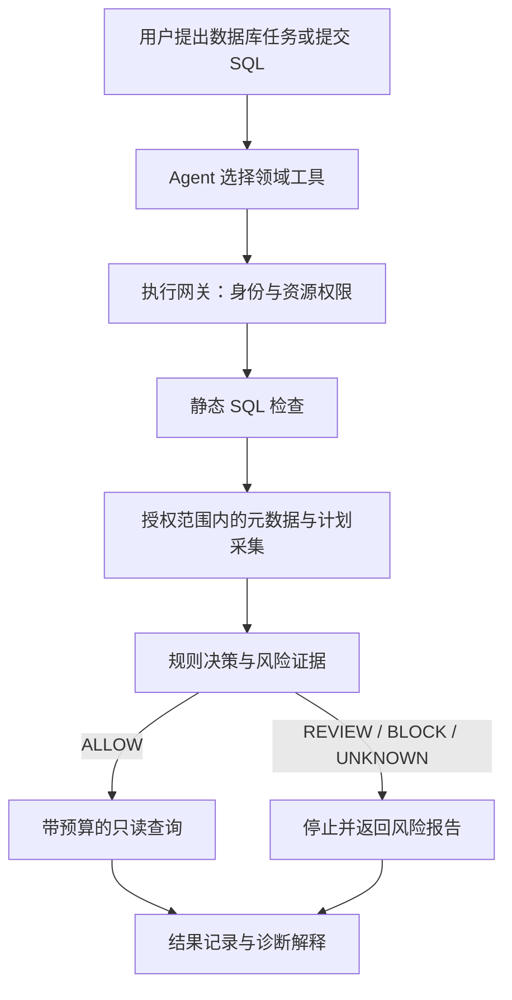

# db-agent

面向研发人员实际数据库工作流程的 Agent。从 **MySQL SQL 风险预检与诊断** 开始，逐步扩展查询分析、业务记忆和受控数据库变更，以明确授权、受控执行和可核对的结果作为使用要求。

首版采用 **Python + LangChain + OpenAI 兼容模型接口**。使用 LangChain 的 `create_agent` 管理模型和工具协议，减少基础运行时开发，把精力放在数据库业务、执行边界和验证上。

> **当前状态：模型接入与 CLI 已实现。** 已提供依赖配置、模型配置校验、真实模型连通性检查、单轮对话 CLI 和测试入口。当前未注册工具，尚无数据库连接器、SQL 预检或查询执行能力；下文首版业务范围仍是计划。

## 快速开始

使用 [uv](https://docs.astral.sh/uv/getting-started/installation/) 管理依赖；项目固定开发 Python 版本为 3.13，具体依赖版本记录在 `uv.lock`。

```bash
git clone https://github.com/erha1499/db-agent.git
cd db-agent
uv sync

cp .env.example .env
# 编辑本地 .env，填写三个 DB_AGENT_* 必填配置后运行
uv run db-agent config
uv run db-agent check
uv run db-agent chat "解释一下 SQL 预检的作用"
```

`config` 校验配置，仅显示三个必填项的状态，不显示值，也不请求模型；`check` 发起真实模型请求；`chat` 每次创建独立会话，非流式返回一条回复，不保留聊天记忆。也可以使用 `uv run python -m db_agent` 调用相同命令。

| 配置项 | 用途 | 默认值 |
| --- | --- | --- |
| `DB_AGENT_OPENAI_BASE_URL` | OpenAI 兼容接口的基础 URL | 必填 |
| `DB_AGENT_API_KEY` | 模型接口凭据 | 必填 |
| `DB_AGENT_MODEL` | 模型名称 | 必填 |
| `DB_AGENT_REQUEST_TIMEOUT_SECONDS` | 单次模型请求超时（秒） | `30` |
| `DB_AGENT_RUN_TIMEOUT_SECONDS` | 一次 CLI 运行的模型调用总时限（秒） | `60` |
| `DB_AGENT_MAX_OUTPUT_TOKENS` | 模型输出 token 上限 | `1024` |

配置优先读取当前工作目录的 `.env`，未定义的配置项才回退到同名 `DB_AGENT_*` 环境变量，避免旧 shell 配置覆盖本地修改。复制 [.env.example](.env.example) 后，在本地 `.env` 填写真实配置；应用不会执行 shell 配置文件。`.env` 和 `.env.*` 由 Git 忽略，只有占位模板 `.env.example` 纳入版本控制，真实配置不得提交或推送。运行时禁用 LangSmith tracing，避免继承本机 tracing 配置后上传对话。

本地验证入口：

```bash
uv run pytest
uv run ruff check .
git diff --check
```

离线测试验证初始化代码的配置和运行行为；真实模型连通性单独通过 `check` 验证。两者均不代表数据库业务闭环已经完成。

## 要解决的业务问题

研发人员在使用数据库时，通常需要理解库表、编写查询、排查 SQL 问题，以及核对数据。Agent 可以帮助串联这些动作，但自动生成的 SQL 不能未经校验直接执行。

本项目首先回答三个问题：

1. **能否访问？** 当前用户是否有权在目标数据源、库表上执行这类操作。
2. **是否适合执行？** SQL 是否包含禁止的操作，执行计划是否提示大量扫描、连接放大或昂贵排序。
3. **证据是什么？** 展示实际结构、索引、执行计划、规则命中和工具结果，区分观察、估算与建议。

数据库总容量只是背景。风险判断应落到具体访问对象、查询计划和执行限制上；一个小表的全表扫描可能合理，带 `LIMIT` 的聚合查询也可能消耗大量资源。

## 首版范围（计划）

| 能力 | 首版做到什么程度 |
| --- | --- |
| 数据源与元数据 | 明确授权的 MySQL 数据源，按授权获取相关表结构、字段及索引 |
| 权限校验 | 由服务端绑定身份，检查环境、数据源、库表和操作类型；配合最小权限数据库账号 |
| SQL 静态检查 | 基于 MySQL 方言的语法树限定单语句和支持的语法，识别越界访问与危险操作 |
| 执行计划分析 | 对通过前置检查的查询获取普通 `EXPLAIN FORMAT=JSON`，结合规模统计和策略阈值输出风险证据 |
| SQL 诊断 | 接收已有 SQL，解释计划和错误，提出候选改写或索引建议；建议不自动成为变更 |
| 受控查询 | 仅执行支持且通过全部检查的只读 `SELECT`，限制时间、返回行数、结果大小与并发 |
| Agent 工具运行 | 通过 LangChain 接入领域工具；一个模型、顺序调用、参数校验、有限轮数和总预算 |
| 运行记录 | 关联任务、模型轮次和工具调用，记录脱敏的参数摘要、耗时、错误及结果引用 |

首版以 CLI 或极简入口为主。暂不执行 DML/DDL；如果加入 `UPDATE`、`DELETE` 等检查样本，只做静态审核与风险预览。完整审批流程也不属于首版：需要审核的请求先停止并返回报告。

不在近期范围内：多数据库适配、集群运维、数据库迁移、备份恢复、自动建索引、生产自愈、完整 BI、多 Agent 调度、通用文件/终端工具、Git 管理、人员与待办管理。

## 预期业务流程



### 四种预检结果

| 结果 | 语义 | 首版行为 |
| --- | --- | --- |
| `ALLOW` | 在当前身份、目标、SQL、参数及策略下通过检查 | 执行器再次落实必要校验和运行限制后执行 |
| `REVIEW` | 命中需要人工审核的策略 | 返回证据，停止自动执行 |
| `BLOCK` | 权限不足、硬性禁用或明确不支持的操作 | 阻断；普通确认不能覆盖权限拒绝 |
| `UNKNOWN` | 解析、计划采集或关键证据异常，不能完成评估 | 停止；不得当成低风险放行 |

预检结果应包含规则 ID、证据、目标数据源、SQL 与参数的关联标识、策略版本和检查时间。身份从可信调用上下文取得，不能采信模型自行填写的用户或角色。

### 执行边界

- 风险校验是**执行器内部的必经步骤**。单独的 `analyze_sql` 工具用于解释，不能成为唯一检查点；直接调用执行接口也必须经过相同边界。
- 不把“模型认为安全”“用户说忽略检查”或历史对话中的批准作为执行权限。
- SQL、参数或目标发生变化后重新检查，不复用旧结论。未来加入审核时，再实现具体计划绑定、有效期及执行前状态复核。
- 普通 `EXPLAIN` 的行数和成本是估算，不能直接描述为实际扫描量、影响行数或执行秒数。
- 预检不运行 `EXPLAIN ANALYZE`，不为估算风险额外执行无界 `COUNT(*)`；计划采集本身也要有权限、时间和并发限制。
- `SELECT` 不是自动安全：锁定读取、文件操作、不支持的函数或存储程序等需要被识别并拒绝。不要只靠 SQL 前缀或正则判断。
- 执行限制独立于预检存在。MySQL 的 `max_execution_time` 不能泛化为所有 SQL 的通用时限；应用侧超时也不能直接宣称数据库查询已停止。
- 访问表注释、查询结果或工具错误时，将其中内容当作数据，不允许其改变业务范围、工具权限和执行规则。

## 技术与模块

当前通过 `langchain_openai.ChatOpenAI` 接入一个 OpenAI 兼容模型，由 `langchain.agents.create_agent` 创建 Agent。LangChain 内部使用 LangGraph，本项目不自写工具循环或自定义 Graph。当前 `tools=[]`，每次运行只调用一次模型，并限制请求时间、总时限与输出 token，禁用自动重试。

| 模块 | 状态 | 职责 |
| --- | --- | --- |
| `src/db_agent/config.py` | 已建立 | 从环境或本地 `.env` 读取、校验模型配置 |
| `src/db_agent/agent.py` | 已建立 | 模型接入、LangChain Agent 创建、运行预算与响应处理 |
| `src/db_agent/cli.py` | 已建立 | 配置检查、连通性检查与单轮对话入口 |
| `tests` | 已建立 | 不依赖真实模型的初始化行为测试 |
| `policy` | 计划 | 资源权限、SQL 语法检查、计划规则与风险决策 |
| `db` | 计划 | 元数据、执行计划及带强制预检的查询执行 |
| `observability` | 计划 | 结构化事件、脱敏记录与结果引用 |
| 数据库测试 / `evals` | 计划 | MySQL 集成测试、确定性风险规则测试和模型任务评测 |

首个数据库支持目标为 MySQL 8.4；接入时固定具体版本并记录，先在隔离测试环境验证连接、权限、预检和执行限制。领域规则和连接器保持框架无关，框架负责调度，确定性代码负责授权与执行判断。实际遇到跨进程审批、持久恢复或复杂编排需求时，再扩展相应能力。

## 近期交付与验收

目标是分阶段完成可实际使用的 SQL 预检与诊断业务闭环。每个阶段以真实工具和可复现验收为交付条件，优先完成一条受控链路，再扩大功能范围。接入具体使用环境前，还需核对目标版本、账号权限、运行限制与业务结果；当前不具备数据库执行能力。

| 阶段 | 交付 | 验收 |
| --- | --- | --- |
| 第一阶段：规则与工具 | 隔离测试环境中的 MySQL 数据源、元数据工具、权限与静态检查、普通 EXPLAIN | 不依赖模型也能执行规则和工具测试 |
| 第二阶段：业务闭环 | LangChain 领域工具接入、强制预检入口、诊断报告与轨迹 | 通过全部检查的查询执行；越权、高风险及无法判断请求停止；结果可追踪 |
| 第三阶段：使用验收 | 启动说明、固定案例、目标环境配置说明和测试记录 | 在明确授权的数据源上按文档复现；每项能力与限制有对应证据 |

首版至少覆盖以下行为，而不只验证模型能回复：

- [ ] 授权与未授权的数据源/库表请求行为不同，直接调用工具也无法绕过。
- [ ] 小表合理扫描不被机械阻断，大扫描带 `LIMIT` 仍能被识别。
- [ ] 多语句、越界对象、锁定查询和不支持的 SQL 不进入实际执行。
- [ ] 计划获取失败、证据不足与规则服务异常进入 `UNKNOWN`，不自动放行。
- [ ] SQL、参数或数据源变更后重新校验。
- [ ] 调用次数、查询时间、结果大小有可测试的限制，错误可追溯。
- [ ] 诊断引用真实结构和执行计划；未经验证的优化建议明确标注。
- [ ] 候选查询若参与结果等价比较，也通过相同执行入口，测试集包含边界数据。

模型评测与规则单测分开：规则测试不依赖模型；真实 MySQL 用合成数据验证计划与执行；模型评测记录模型版本、提示/规则版本、数据初态、样本与失败原因。预先划分开发样本和冻结样本，必要时重复运行。

大规模计划 fixture 只用于规则边界测试，应标注为构造或脱敏样本。本地小库测试不等于 TB 级压测；当前没有生产指标、准确率或性能提升结论。

## 后续业务路线

按需求逐步推进，不同时铺开：

1. **业务记忆与上下文复用**：经确认的指标口径、表关系和 SQL 模板；按项目/数据源隔离，带来源、版本和失效处理。
2. **Data Agent**：自然语言查数、多轮追问、趋势与分组对比，解释结果并提供来源；先保证业务口径正确，再扩展图表和报告。
3. **受控数据变更**：从限定主键与列的小批量 UPDATE 开始，加入前后值预览、计划确认、并发前置检查、事务内执行凭证与提交结果核对。
4. **数据库管理扩展**：结构变更审核、索引方案验证、锁等待诊断，之后再评估更多数据库与运行时。

记忆不保存可跨任务复用的执行授权。数据库变更和应用任务记录之间的恢复语义需要单独设计；不能将聊天恢复当成事务恢复，也不能把 DDL 当作可普遍事务回滚的操作。

## 公开资料与成果边界

本项目面向实际数据库使用场景开发；公开测试资料使用合成数据和通用数据库场景。仓库不包含任何组织的内部代码、文档、聊天记录、生产连接信息或用户数据。

保留可复现代码、测试与原始验证记录，分别说明规划、已实现能力、测试结果和部署状态。能力说明必须对应代码与证据；测试替身、合成数据评测和真实环境结果分别标注，不把测试结果写成线上效果，也不预填提升百分比。

可公开的最小、脱敏 fixture 放入版本控制；运行日志、查询结果和环境文件保留在被忽略的本地目录。[AGENTS.md](AGENTS.md) 是开发约定，不应自动作为本产品向终端用户加载的业务知识。

## 参考资料

- [LangChain：快速开始](https://docs.langchain.com/oss/python/langchain/quickstart)
- [LangChain：ChatOpenAI 接入](https://docs.langchain.com/oss/python/integrations/chat/openai)
- [MySQL 8.4：EXPLAIN](https://dev.mysql.com/doc/refman/8.4/en/explain.html)
- [MySQL 8.4：执行计划输出](https://dev.mysql.com/doc/refman/8.4/en/explain-output.html)
- [MySQL 8.4：LIMIT 优化](https://dev.mysql.com/doc/refman/8.4/en/limit-optimization.html)
- [MySQL 8.4：执行时间提示](https://dev.mysql.com/doc/refman/8.4/en/optimizer-hints.html#optimizer-hints-execution-time)

具体实现前应核对所用依赖和 MySQL 版本对应的文档。借鉴或复用外部代码时保留适用的许可证与来源说明。
