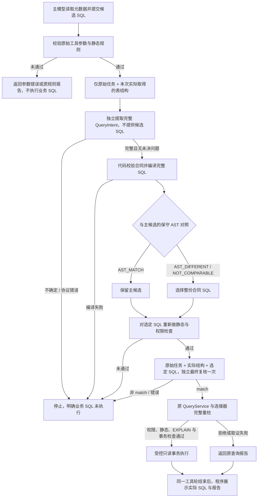

# 查询执行前的需求核对

SQL 可以满足只读规则，却遗漏用户要求的筛选条件。因此 `chat` 在候选查询执行前，额外核对它是否完整表达原始需求；数据库权限、风险预检与业务结果验收仍分别判断。

## 执行流程

主生成、需求提取和最终复核使用同一个配置模型。需求提取只接收用户原始请求（含显式提供的业务口径）和本次实际取得的表结构，不接收主候选 SQL、生成者历史或业务行。它先确定用户最终要得到的对象集合或统计值，再填写完整 `QueryIntent`：投影、来源表、关联、WHERE、GROUP BY、HAVING、排序、LIMIT/OFFSET，以及未决问题。用户给出 JOIN 等实现提示，不能据此扩大其要求的结果集合。

运行代码为每份完整合同记录原始请求的 SHA256，绑定实际输入；模型只输出查询要求与未决问题，不负责复述原文或提供可信来源标识。`intents.py` 校验表达式、结构绑定和当前 SQL 子集，再从整份合同编译 SQL。代码不向原候选局部补条件。保守 AST 对照只处理有限的表示差异和已解析的别名绑定，保留字面值、完整谓词、投影与分组顺序、排序方向和数量限制；对照一致才保留主候选，不同或无法比较时选择完整合同 SQL，再重新预检并复核。

最终复核使用新的上下文，只接收原始请求、选定 SQL 及其实际表结构，不接收合同提取者的解释或历史审查结果。复核覆盖六个方面：查询对象与关联、行及分组筛选、时间字段与边界、分组统计、返回列、排序与数量限制。用户明确查全部时，没有 WHERE 或 HAVING 可以正确；直接给出 SQL 并要求尝试执行时，给定 SQL 本身定义任务，仍须经过原有执行规则。

| 阶段结果 | 处理 |
| --- | --- |
| 合同缺失、有未决问题或无法完整编译 | 停止执行，不退回原候选 |
| 最终复核 `match` | 仅表示模型判断业务要求已对应；继续原数据库检查，不能覆盖任何拒绝 |
| 最终复核 `mismatch` 或 `uncertain` | 停止执行；即使协议中带有 `replacement_sql`，当前运行时也不执行它或再循环修正 |
| 协议错误、截断、请求失败或预算不足 | 停止执行，不使用不完整结论 |

请求指纹只用于关联实际输入，不能证明模型理解正确，也不能作为执行凭证。有限 AST 对照不能证明一般 SQL 等价，更不能证明合同完整表达自然语言。“独立上下文”也不表示使用独立模型或具有统计独立性：同一个模型仍可能在提取与复核中重复漏读。严格合同与审查协议约束的是处理流程，业务正确性仍需独立预期结果和未参与调整的任务验收。

合同编译还有保守的兼容限制：字面值含真实换行、回车或制表符时，SQLGlot 序列化可能产生当前策略不支持的转义，因而停止执行。直接 `db query` 仍按原始 SQL 的既有规则判断；不能把两条入口的支持范围视为完全相同。

## 框架、预算与数据范围

- 仍使用 LangChain `create_agent`。运行中间件在查询工具执行前提取合同并复核。正常路径会处理完同一工具轮内的全部工具调用，再通过框架原生 `before_model` 节点终止；不是在第一条查询返回时跳过该轮其余工具。所有调用仍受顺序、预算、错误与取消规则限制，没有自定义 Graph。
- `QueryService`、连接器和直接 `db query` 不调用模型。直接输入 SQL 的 CLI 继续执行确定性预检；自然语言与 SQL 的需求核对属于 `chat` 流程。
- 主生成、需求提取和最终复核共享默认 4 次模型调用预算；领域工具与自动补取结构合计最多 6 次，整个运行最多 60 秒，每次输出最多 1024 token，禁止自动重试。通过静态检查的每次查询还需意图提取、最终复核两次调用；若没有剩余预算，停止而不是省略阶段或增加调用。
- 两个语义阶段均使用标准 function calling、`tool_choice="auto"` 和 `include_raw=True`。服务端分别只接受唯一、完整的 `QueryIntent` / `SemanticReview` 调用，校验原始工具参数与解析对象一致，拒绝协议外字段、截断、解析错误及自由文本替代结果。自动工具选择不降低服务端解析要求。
- 元数据从受控连接器取得并在单次运行中复用。先按白名单和预算补取主候选涉及的结构，再把本次已实际取得的全部结构提供给需求提取；不会把未取得的结构或猜测的关系当作事实。选定 SQL 的引用对象仍须重新核对。
- 查询业务行由程序直接展示，不进入需求提取或最终复核消息；同一查询工具轮结束后不再发起模型 HTTP 请求，也不为结果补一轮自由回答。用户问题、SQL 字面值、实际表结构及此前诊断计划摘要仍可能进入配置模型，脱敏日志不代表这些输入自动脱敏。
- 常规运行记录只保存阶段、耗时、固定错误码和调用序号等脱敏事件，不保存需求、SQL、合同、审查内容或业务行。公开合成数据的显式评测可在被忽略的本地报告中保留候选、编译合同、选择结果、复核与查询证据。
- 总运行超时、模型请求超时和次数预算耗尽保留已经取得的可信观察，评测仍判失败。尚在需求核对中停止的查询标记 `not_started`；已经进入查询处理器的尝试不能据此宣称 SQL 未派发或数据库已取消。

## 验收方式

离线测试应验证：合同提取没有候选输入、完整编译与保守选择、只提交最终复核通过的 SQL、不确定和协议错误时执行零次、原始参数不能被替换过程洗成合法调用，以及权限拒绝、预算累计、同轮工具完成与取消清理。它们证明控制流程，不证明真实模型的识别能力。

[开发语义正反例](../evals/semantic-regression.json) 刻意删除或改变 WHERE、HAVING、时间边界、返回列与排序，并保留合法全量查询和直接指定 SQL 的对照。单独审查这些候选的漏检、误拦，与完整合同执行链路的验收分开统计，不能相互替代。

历史错误候选的定向重放可以固定主生成节点，保留真实需求提取、复核和 MySQL 查询，核对错误 SQL 未派发且实际行符合人工预期。这类运行必须标明主生成器是 fixture；运行计数包含该节点，不能宣称所有计数都是实际模型 HTTP 请求。

完整业务任务继续由电商评测脚本执行真实受控查询，并与固定账本推导的预期值比较。拦住错误 SQL 但没有完成一个应成功的任务，仍算业务失败；首次验收前冻结产品与题目，未根据新题结果调整，原题、独立预期和首次失败保留。运行结果见 [电商验收记录](ecommerce.md)。
